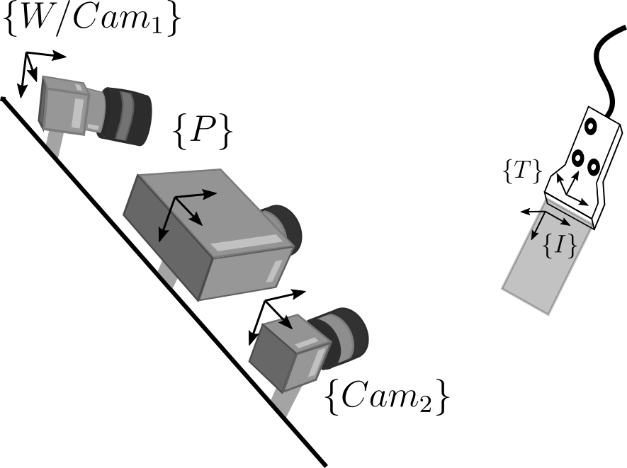
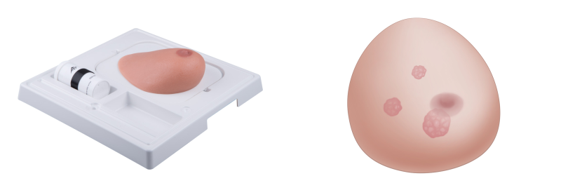
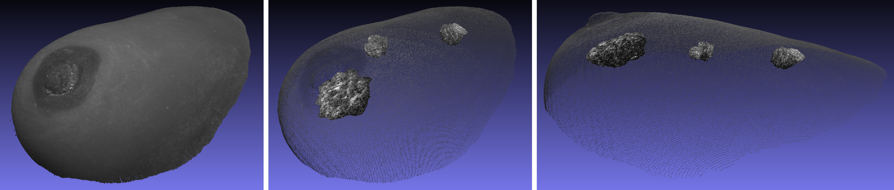

# 3D multimodal medical imaging technique based on freehand ultrasound and structured light

This is the main repository for the 3D multimodal imaging technique using freehand ultrasound and 3D reconstruction by structured light.

<div align="center">

[![Paper](https://img.shields.io/badge/Optical_Engineering-DOI-blue?style=flat&logo=data:image/svg%2bxml;base64,PHN2ZyBhcmlhLWhpZGRlbj0idHJ1ZSIgZGF0YS1wcmVmaXg9ImZhcyIgZGF0YS1pY29uPSJlbnZlbG9wZSIgY2xhc3M9InN2Zy1pbmxpbmUtLWZhIGZhLWVudmVsb3BlIGZhLXctMTYiIHdpZHRoPSIxNiIgaGVpZ2h0PSIxNiIgeG1sbnM9Imh0dHA6Ly93d3cudzMub3JnLzIwMDAvc3ZnIj48cGF0aCBzdHlsZT0ic3Ryb2tlLXdpZHRoOi4wMDI0ODkzNTtmaWxsOiMwMDdlYzY7ZmlsbC1vcGFjaXR5OjEiIGQ9Ik0zLjQ3IDYuOTJjLS4zMTMgMC0uNjA0LjIyOC0uODA1LjQ2NS0uMTY0LjE5Mi0uMjQ1LjQ4OC0uMjQ1LjczNCAwIC4yNDcuMDkyLjUyLjI1Ni43MTMuMTk4LjIzNy40MTIuNC43MjkuNC4yODUgMCAuNjI0LS4xMi44MTktLjMxNi4xOTgtLjE5NS4zNjMtLjUyMy4zNjMtLjgwOCAwLS4yODEtLjA3Ny0uNjE5LS4yNzUtLjgxNC0uMTk5LS4xOTgtLjU2LS4zNzQtLjg0MS0uMzc0Wm01LjYzNC4wNzdhLjk3My45NzMgMCAwIDAtLjc5Ny4zODUgMS4wOSAxLjA5IDAgMCAwLS4yNS43MDRjMCAuMjY3LjA4NC41MDMuMjUuNzEuMjA1LjI1Ni40Ny4zODQuNzk3LjM4NGEuOTg3Ljk4NyAwIDAgMCAuNzQtLjMxNGMuMjAyLS4yMTMuMzAyLS40NzIuMzAyLS43OCAwLS4zMDQtLjEwMi0uNTYtLjMwNy0uNzdhLjk3NS45NzUgMCAwIDAtLjczNS0uMzE5Wk04IDBhOCA4IDAgMSAwIDAgMTZBOCA4IDAgMCAwIDggMFpNNi4xMDIgMTAuNDQ1SDQuNjIxdi0uNjAzYy0uMTUuMTg5LS41MDUuMzgxLS42NTguNDY3LS4yNy4xNS0uNjM0LjI0OS0uOTc3LjI0OWEyLjE1OCAyLjE1OCAwIDAgMS0xLjQ3OS0uNTU2Qy45OTIgOS41NDcuNzUgOC44NTIuNzUgOC4xMDNjMC0uNzYxLjI2NC0xLjM3Ljc5Mi0xLjgyNC40Mi0uMzYyLjkzMi0uNjUxIDEuNDc2LS42NTEuMzE3IDAgLjcwOC4wMjguOTg2LjE2Mi4xNi4wNzcuNDQ3LjI1OC42MTcuNDM0VjMuMDQ3aDEuNDgxdjcuMzk4Wm01LjA3Mi0uNjgyYy0uNDkzLjU2Ny0xLjE4My44NTEtMi4wNy44NTEtLjg5IDAtMS41OC0uMjg0LTIuMDc0LS44NTEtLjQwNi0uNDY2LS42MS0xLjAzOS0uNjEtMS43MTcgMC0uNjEyLjIwNS0xLjE1NC42MTUtMS42MjYuNDk2LS41NzEgMS4yMDItLjg1NyAyLjExNy0uODU3Ljg0MiAwIDEuNTE0LjI4NiAyLjAxNy44NTdhMi40NCAyLjQ0IDAgMCAxIC42MTUgMS42NjZjMCAuNjUyLS4yMDQgMS4yMS0uNjEgMS42Nzd6bTEuMjUtNi40MjZhLjg1Ni44NTYgMCAwIDEgLjYzLS4yNmMuMjQ2IDAgLjQ1Ni4wODcuNjI4LjI2YS44NC44NCAwIDAgMSAuMjYuNjI0YzAgLjI1LS4wODcuNDYtLjI2LjYzNGEuODU0Ljg1NCAwIDAgMS0uNjI5LjI1NC44NTYuODU2IDAgMCAxLS42MjktLjI2Ljg2NS44NjUgMCAwIDEtLjI1NC0uNjI4YzAtLjI0Ny4wODUtLjQ1NS4yNTQtLjYyNHptMS40MTcgNy4xMDRoLTEuNTc1VjUuNzM3aDEuNTc1eiIvPjwvc3ZnPg==)](https://doi.org/10.1117/1.OE.60.5.054106)
[](https://arxiv.org/abs/2105.14355)
[![Project Page](https://img.shields.io/badge/Project-Page-orange?style=flat&logo=data:image/svg%2bxml;base64,PHN2ZyB3aWR0aD0iMTYiIGhlaWdodD0iMTYiIHhtbG5zPSJodHRwOi8vd3d3LnczLm9yZy8yMDAwL3N2ZyI+PGcgc3R5bGU9ImZpbGw6I2Y0ODA0MTtmaWxsLW9wYWNpdHk6MSI+PHBhdGggZD0iTTIyMC4xMTggMzE3Ljg4M2EyNS45MTcgMjUuOTE3IDAgMCAxLTE4LjM4NS03LjYxNWMtNDcuNTY3LTQ3LjU2OC00Ny41NjctMTI0Ljk2NyAwLTE3Mi41MzVsOTYtOTZDMzIwLjc3NyAxOC42OSAzNTEuNDEzIDYgMzg0IDZjMzIuNTg3IDAgNjMuMjI0IDEyLjY5IDg2LjI2OCAzNS43MzIgNDcuNTY2IDQ3LjU2OCA0Ny41NjYgMTI0Ljk2NyAwIDE3Mi41MzVsLTQzLjg4MyA0My44ODNjLTEwLjE1NCAxMC4xNTQtMjYuNjE1IDEwLjE1NC0zNi43NyAwLTEwLjE1My0xMC4xNTMtMTAuMTUzLTI2LjYxNiAwLTM2Ljc3bDQzLjg4My00My44ODNjMjcuMjkyLTI3LjI5MyAyNy4yOTItNzEuNzAyIDAtOTguOTk1QzQyMC4yNzcgNjUuMjgxIDQwMi42OTggNTggMzg0IDU4Yy0xOC42OTggMC0zNi4yNzYgNy4yODEtNDkuNDk4IDIwLjUwM2wtOTYgOTUuOTk5Yy0yNy4yOTMgMjcuMjkzLTI3LjI5MyA3MS43MDMgMCA5OC45OTYgMTAuMTU0IDEwLjE1MyAxMC4xNTMgMjYuNjE2IDAgMzYuNzdhMjUuOTE5IDI1LjkxOSAwIDAgMS0xOC4zODQgNy42MTV6IiBzdHlsZT0iZmlsbDojZjQ4MDQxO2ZpbGwtb3BhY2l0eToxIiB0cmFuc2Zvcm09Im1hdHJpeCguMDMyIDAgMCAuMDMyIC0uMTM2IC0uMTkyKSIvPjxwYXRoIGQ9Ik0xMjggNTA2Yy0zMi41ODggMC02My4yMjUtMTIuNjktODYuMjY3LTM1LjczMi00Ny41NjctNDcuNTY4LTQ3LjU2Ny0xMjQuOTY3IDAtMTcyLjUzNWw0My44ODItNDMuODgyYzEwLjE1NC0xMC4xNTMgMjYuNjE3LTEwLjE1MyAzNi43NyAwIDEwLjE1NCAxMC4xNTMgMTAuMTU0IDI2LjYxNiAwIDM2Ljc3bC00My44ODIgNDMuODgyYy0yNy4yOTMgMjcuMjkzLTI3LjI5MyA3MS43MDMgMCA5OC45OTZDOTEuNzIzIDQ0Ni43MTkgMTA5LjMwMiA0NTQgMTI4IDQ1NHMzNi4yNzYtNy4yODEgNDkuNDk5LTIwLjUwM2w5Ni05NS45OTljMjcuMjkyLTI3LjI5MyAyNy4yOTItNzEuNzAzIDAtOTguOTk2LTEwLjE1NC0xMC4xNTQtMTAuMTUzLTI2LjYxNiAwLTM2Ljc3IDEwLjE1My0xMC4xNTMgMjYuNjE2LTEwLjE1MyAzNi43Ny4wMDEgNDcuNTY2IDQ3LjU2NyA0Ny41NjYgMTI0Ljk2Ni4wMDEgMTcyLjUzNGwtOTYuMDAxIDk2QzE5MS4yMjQgNDkzLjMxMSAxNjAuNTg3IDUwNiAxMjggNTA2WiIgc3R5bGU9ImZpbGw6I2Y0ODA0MTtmaWxsLW9wYWNpdHk6MSIgdHJhbnNmb3JtPSJtYXRyaXgoLjAzMiAwIDAgLjAzMiAtLjEzNiAtLjE5MikiLz48L2c+PC9zdmc+)](https://jhacsonmeza.github.io/SL+3DUS/)

</div>

With the proposed technique, we can obtain the internal structure with 3D freehand ultrasound and complement this information with the external features acquired with structured light. Our system is composed of two cameras, a projector, and an ultrasound machine as shown in the following figure.

<p align="center">
    
</p>

The 3D freehand ultrasound system is composed of the stereo vision system and the ultrasound machine. The stereo vision system {Cam1} - {cam2} and a target of three coplanar circles attached in the probe are used for pose estimation for freehand ultrasound reconstruction. Subpixel Point detection of the target and pose estimation are addressed using MarkerPose [[paper](https://arxiv.org/abs/2105.00368) | [code](https://github.com/jhacsonmeza/MarkerPose)] a method based on Deep Learning. {Cam1} and the projector {P} are used for external 3D reconstruction using structured light techniques. The acquired information with both modalities is referred to the same world frame, which is {Cam1}. In this way, we avoid data registration.

In this repo, code for 3D multimodal reconstruction is available. The following codes are also available:
* [3D freehand ultrasound calibration](https://github.com/jhacsonmeza/US-Calibration)
* [Stereo vision and ultrasound simultaneous image acquisition](https://github.com/jhacsonmeza/StereoBaslerUltrasound)
* [MarkerPose: robust, real-time pose estimation method](https://github.com/jhacsonmeza/MarkerPose)

## Dependencies

* Python 3
* NumPy
* OpenCV
* PyTorch
* Numba

## Structure of the repository
`sl_us/` folder contains the modules needed for structured light (`sl3d.py`) and freehand ultrasound (`us3d.py`) reconstruction, phase recovery (`centerline.py`), and some utility functions (`utils.py`). Furthermore, `MarkerPose/` folder contains `models.py` where deep neural networks for pose estimation are defined and `utils.py` where some functions are defined to aid the process. Finally, `ProbePose.py` and `multimodal_recons.py` are the scripts for pose estimation of the marker for freehand ultrasound and multimodal 3D reconstruction, respectively.

## Usage example

With this example, you can recreate the multimodal reconstruction results shown in the paper. For that, we use a breast phantom [3B SONOtrain P125](https://www.3bscientific.com/sonotrain-breast-model-with-tumours-1019635-p125-3b-scientific,p_1397_27469.html), shown in the following figure.

<p align="center">
    
</p>

This model consists of three breast tumors in the positions shown in the image. 170x130x55 mm is the phantom's dimensions. For this example, the external surface of the breast is reconstructed with structured light patterns. The internal three tumors are also reconstructed with the 3D freehand ultrasound method, for that, different images of each tumor were acquired with slight displacements between frames.

To run this example:

* Clone this repository: `git clone https://github.com/jhacsonmeza/StructuredLight_3DfreehandUS.git`
* `cd StructuredLight_3DfreehandUS`
* You need to download the `dataset/` folder of projected patterns and freehand ultrasound acquisition of the phantom [here](https://drive.google.com/drive/folders/1abZWgODq2XpUyIZclIMR59ldTdKFfqie?usp=sharing). In this folder you can find `SLdata/` with the images for structured light reconstruction, `USdata/` with images for pose estimation of the probe, and ultrasound B-scans of the tumors for 3D reconstruction. Furthermore, you can find camera-projector stereo parameters (`cam1_proj_params.npz`), camera1-camera2 stereo parameters (`cam1_cam2_params.npz`) for pose estimation, and freehand ultrasound calibration parameters (`US_params.npz`). Finally, the weights of the deep neural network models `superpoint.pt` and `ellipsegnet.pt` for pose estimation with MarkerPose.  
* Run `python ProbePose.py` for pose estimation of the marker/ultrasound transducer with MarkerPose. This snippet of code shows the estimated pose for each ultrasound scan acquired. It generates a file `target_pose.npy` with the position and orientation of the marker relative to {Cam1}.
* As the last step, run `python multimodal_recons.py` for multimodal 3D reconstruction of the external surface of the breast phantom and the internal three tumors. It will generate a file `SL_US_3D.ply`, which you can visualize, for example, with the open-source software [MeshLab](https://www.meshlab.net/). See also the results in our interactive 3D visualization of the reconstructions in our [project page](https://jhacsonmeza.github.io/SL+3DUS/).

A visualization example of the generated point cloud is shown below.

<p align="center">
    
</p>


## Our proposed multimodal technique as a navigation system

We can use the proposed multimodal system as a navigation system where the ultrasound image and a model of the probe can be displayed in real-time with the reconstructed surface. This visualization can be useful for image interpretation and spatial understanding during an intervention. An example during the acquisition of the ultrasound images of the three tumours of the breast phantom is shown below. MarkerPose allows us real-time pose estimation performance with GPU, which enables real-time visualization for navigation. The 3D animation was generated with [OpenCV 3D Visualizer](https://docs.opencv.org/master/d1/d19/group__viz.html).


<p align="center">
    
</p>


## Citation

If you find this code useful, please cite our paper:

```
@article{meza2021three,
  title={Three-dimensional multimodal medical imaging system based on freehand ultrasound and structured light},
  author={Meza, Jhacson and Contreras-Ortiz, Sonia H and Romero, Lenny A and Marrugo, Andres G},
  journal={Optical Engineering},
  volume={60},
  number={5},
  pages={054106},
  year={2021},
  publisher={International Society for Optics and Photonics}
}
```
